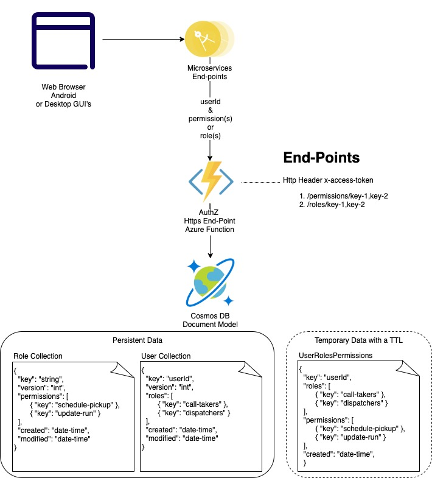

# Azure Authorization Service

## Objectives

* A single-concern service responsible for application permission/role checking
* Accepts `access_token` for caller identity as an Http Header and permission(s) or role(s) as url path params
* Returns a yes/no answer for each permission/role requested
* The service does not implement any meaning for permissions or roles
* The calling GUI/Service provides an interpretation for the role/permission
* The service does not provide authorization data management functionality, a separate end-point will address these concerns

## Design



* The decision was not to rely on Azure AD user groups to eliminate dependency on IT personnel
* The service is solely responsible for high performance and availability
* The service will leverage Cosmos DB with Core Sql API for high performance and availability
* The owner of the service may decide to implement a caching strategy in case of performance issues detected
* During the transition period from Legacy to SaaS implementation, authorization data will be replicated from the legacy db

## End-points

### Permissions

The end-point will validate access token before processing the request

#### Request

Verb: GET  
Http Headers: 
* x-access-token: the token issued by authentication end-point
* x-correlation-id: optional header for traceability

Path: `/permissions/key-1,key2`

#### Response - Success

Status Code: 200
Body:
```
{
  "userId": "user-principal-id",
  "correlationId": "UUID",
  "timestamp": "date-time"
  "permissions": [
    { 
      "key": "key-1",
      "isAuthorized" false
    },
    { 
      "key": "key-2",
      isAuthorized": true 
    }
  ]
}
```

### Roles

The end-point will validate access token before processing the request

#### Request

Verb: GET  
Http Headers: 
* x-access-token: the token issued by authentication end-point
* x-correlation-id: optional header for traceability

Path: `/roles/key-1,key2`

#### Response - Success

Status Code: 200
Body:
```
{
  "userId": "user-principal-id",
  "correlationId": "UUID",
  "timestamp": "date-time"
  "roles": [
    {
        "key": "schedule-pickup",
        "isAuthorized": false
    },
    {
        "key": "dispatchers",
        "isAuthorized": true
    }
  ]
}
```

## Azure Setup

### Cosmos DB Setup

[Template](./automation/cosmos-db.arm)

1. Create Azure Cosmos DB Sql in the same region where plan to deploy the function
1. Type a unique name e.g. starting with the organization and the env name e.g. `trgos-poc-authzdb`
1. Networking: `All networks`
1. Finish the creation of the account

### Cosmos DB Configuration

1. Select `Data Explorer` link
1. Create new container `Roles` with `Partition key`: `key`,  `Unique Key` `key`, and new database: `authz-data`
1. Add additional collections: `Users` and `UserRolesPermissions` with `Partition Key`: `key` and `Unique Key` `key`
1. Import sample data by selection `Items` under corresponding container and select `Items` and `Upload Item`
1. For `UserRolesPermissions` container configure `Settings` -> `Time to Live` to value of `300 secs`
1. Navigate to Cosmos DB `Keys` to copy `URI`
1. Navigate to `Connection String` -> `Read-write Keys` and copy `URI` and `PRIMARY KEY` 

### To create Azure Functions

```
chmod +x ./automation/*
./automation/create-functions.sh
```

### To configure Azure Functions:

Configure env vars for the function:
```
az functionapp config appsettings set --name trgos-authorization \
  --resource-group authpoc-resource-group \
  --settings "CosmosDbEndpointUri={replace}"

az functionapp config appsettings set --name trgos-authorization \
  --resource-group authpoc-resource-group \
  --settings "CosmosDbPrimaryKey={replace}"

az functionapp config appsettings set --name trgos-authorization \
  --resource-group authpoc-resource-group \
  --settings "CosmosDbDatabaseId=authz-data"

az functionapp config appsettings set --name trgos-authorization \
  --resource-group authpoc-resource-group \
  --settings "RolesContainerId=Roles"

az functionapp config appsettings set --name trgos-authorization \
  --resource-group authpoc-resource-group \
  --settings "UsersContainerId=Users"

az functionapp config appsettings set --name trgos-authorization \
  --resource-group authpoc-resource-group \
  --settings "UserRolesPermissionsContainerId=UserRolesPermissions"
```

### To deploy Azure Functions

```
chmod +x ./automation/*
./automation/create-functions.sh
```


## ToDo:

1. Misconfigured Uri should be error code 500 not 400
4. unit tests